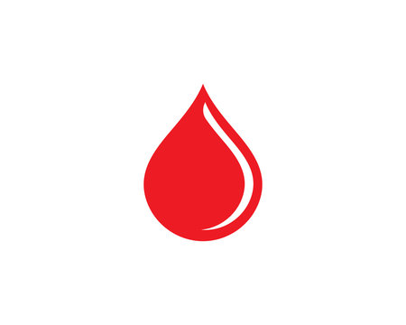

# 🌟 Blood Donation Bangladesh 🌟

Welcome to the **Blood Donation Bangladesh** mobile application! This app aims to connect blood donors and recipients, making it easier for people to donate and receive blood in times of need.



## 📱 Features

- 🔍 **Search Blood Donors**: Easily search for blood donors based on location, blood group, and donation type.
- 🩸 **Donate Blood**: Register as a blood donor and help save lives.
- ❤️ **Need Blood**: Request for blood and get connected to potential donors quickly.
- 👤 **Profile Management**: Manage and update your personal profile information.
- 🔐 **Secure Login**: Ensure your data is safe with secure login and authentication.
- ✅ **Verification**: Verify your account to get a verified badge.

## 🚀 Getting Started

### Prerequisites

Make sure you have the following installed:
- Flutter SDK
- Android Studio or VS Code
- An Android or iOS device/emulator

### Installation

1. **Clone the repository**:
    ```bash
    git clone https://github.com/Unayes09/blood-donation-bangladesh.git
    cd Blood-Donation-Bangladesh-Mobile-App-Flutter
    ```

2. **Install dependencies**:
    ```bash
    flutter pub get
    ```

3. **Run the app**:
    ```bash
    flutter run
    ```

### Building the APK

To build the release APK, follow these steps:

1. **Clean the project**:
    ```bash
    flutter clean
    ```

2. **Update version** in `pubspec.yaml`:
    ```yaml
    version: 1.0.1+2
    ```

3. **Build the APK**:
    ```bash
    flutter build apk --release
    ```

4. **Install the APK** on your device:
    ```bash
    adb install build/app/outputs/flutter-apk/app-release.apk
    ```

## 🎨 Customization

### Profile Page Enhancements

The profile page allows users to view and edit their details. It includes a verification feature:

- **Show Verified Badge**: If the user is verified, display a badge with a light green color.
- **Verify Your Account Button**: If not verified, show a button to start the verification process.

## 📦 API Integration

- **Fetch User Data**: Retrieve user details from the backend.
- **Update User Data**: Update user information through API calls.
- **Verify Account**: Handle account verification through API endpoints.

## 🛠️ Built With

- **Flutter** - The framework used
- **Dart** - Programming language
- **HTTP** - For API calls
- **Shared Preferences** - For local storage

## 📄 License

This project is licensed under the MIT License - see the [LICENSE.md](LICENSE.md) file for details.

## 🙏 Acknowledgements

- Thank you to all the blood donors and volunteers who make saving lives possible.
- Special thanks to the Flutter community for their support and resources.

## 📧 Contact

For any inquiries, please contact us at unayeskhan.0808@gmail.com.

⭐️ Blood Donation Bangladesh - Your contribution can save lives! ⭐️
